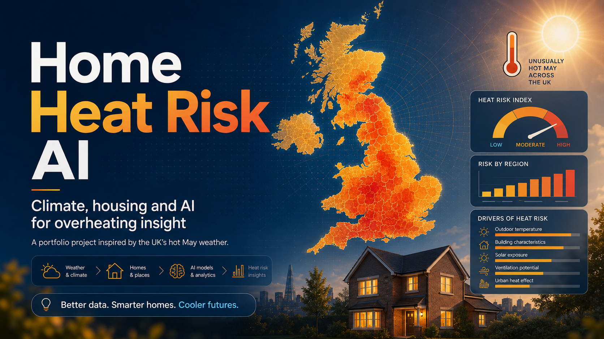

# Home Heat Risk AI

Climate, housing and AI for understanding which UK homes may overheat - and what can help.

**[Live dashboard →](https://home-heat-risk-ai.streamlit.app)**

---

## Summary
| | |
|---|---|
| **Project type** | End-to-end data science dashboard |
| **Domain** | Climate adaptation · Housing · Public policy · Energy |
| **Core skills** | Python, data cleaning, feature engineering, ML interpretation, Streamlit, responsible AI |
| **Output** | Working dashboard + explainable risk score + cooling recommendation tool |

---

## The problem

Britain's homes were built for a cooler climate. After an unusually hot May, I built this project to explore a practical question:

**Which areas are most vulnerable to home overheating, and where might passive cooling no longer be enough?**

Home Heat Risk AI combines climate data, ONS Census housing indicators, real EPC records where coverage is strong, and carbon-intensity data into an explainable overheating risk score per local authority district. The project includes a Streamlit dashboard, risk ranking, cooling recommendation engine, model interpretability, and responsible AI documentation.

**Built with:** Python · Pandas · Scikit-learn · Streamlit · Plotly · ONS Census · EPC bulk data · NESO Carbon Intensity API

---

## Key outputs

- Ranked 41 London and Nottingham-area local authorities by overheating vulnerability
- - Built a hybrid EPC layer using real bulk data where coverage is sufficient and statistical fallbacks where it is not - documented transparently
  - - Created a rules-based cooling recommendation engine covering shading, ventilation, and active cooling - not an LLM; rules are auditable
    - - Trained a Random Forest model to explore which engineered features drive the risk tier, with model interpretability used for explanation rather than ground-truth validation
      - - Included a responsible AI statement explaining that this is area-level risk estimation, not indoor-temperature prediction
---
## What surprised me

The highest-risk areas were not simply the warmest areas. Housing form, renting patterns, density, and EPC quality changed the picture significantly. Overheating risk is not only a weather problem - it is also a housing and inequality problem. Westminster and Haringey score highest not because they are the hottest, but because they combine high density, high flat share, and high private-rented tenure.

---

## The 8-page dashboard

| Page | What it shows |
|---|---|
| Overview | 41 LADs ranked by risk score, top-tier summary |
| Heat trends | Met Office summer Tmax/Tmin 1884–2024, 10-year rolling mean |
| Housing vulnerability | Scatter: flat share, renting, age 65+, EPC D or worse vs risk tier |
| Risk map | All-LAD ranked bar chart + live NESO grid carbon intensity |
| Cooling recommendation | Interactive tool: area + property type + EPC band → recommendation |
| Model interpretability | Random Forest feature importance (train 100%, test 90.9%) |
| Policy insights | Priority LADs combining high risk + high private-rented share |
| Responsible AI | Scope, limitations, fairness, and what this tool should not be used for |

---

## What is real vs. synthesised

| Component | Source | Status |
|---|---|---|
| Summer Tmax / Tmin | Met Office regional climate series (open) | **Real** |
| Grid carbon intensity | NESO Carbon Intensity API (open) | **Real** |
| Housing tenure & type | ONS Census 2021 via NOMIS (open) | **Real** |
| EPC ratings (37 LADs) | MHCLG EPC bulk download | **Real** |
| EPC ratings (1 LAD) | Statistical fallback - < 500 certificates | Fallback |
| EPC ratings (3 LADs) | Statistical prior - no bulk coverage | Synthesised |

---

## Quick start

```bash
git clone https://github.com/yenlikgaisina/home-heat-risk-ai.git
cd home-heat-risk-ai
python -m venv .venv && source .venv/bin/activate
pip install -r requirements.txt
streamlit run app.py
```

---

## Roadmap

- [ ] Add true HadUK-Grid daily 5km hot-day and tropical-night counts
- [ ] - [ ] Add a choropleth map (built in notebook, omitted from live app for deployment weight)
- [ ] - [ ] Validate risk scores against UKHSA heat-health indicators where available
- [ ] - [ ] Expand from London + Nottingham to all England and Wales local authorities
- [ ] - [ ] Add a test suite

- [ ] ---

- [ ] ## Limitations

- [ ] - The EPC layer is hybrid: real bulk data for LADs with ≥ 500 certificates, synthesised priors for the rest
- [ ] - No indoor temperature data - risk is an exposure proxy, not a verified overheating prediction
- [ ] - ML model is trained on an index-derived target; it learns the index by construction and is used for interpretability, not ground-truth validation
- [ ] - This is a portfolio project, not an operational tool - see `docs/responsible_ai_statement.md`

- [ ] ---

- [ ] ## License

- [ ] MIT for the code. Data licenses follow each upstream source - see `docs/data_dictionary.md`.
